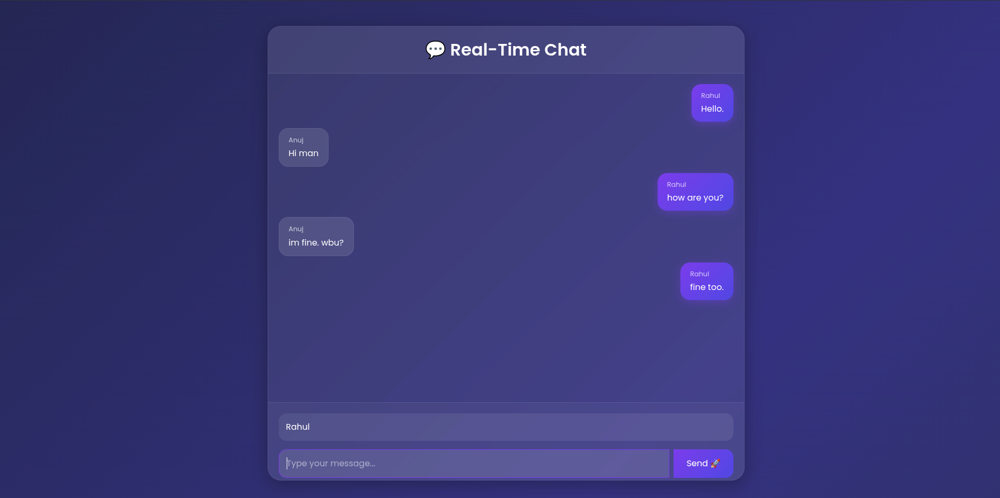

# 💬 Real-Time Chat Application

A modern real-time chat application built using **Spring Boot**, **WebSocket**, **STOMP**, **SockJS**, and **Thymeleaf** with a beautiful animated glassmorphism UI.

---

## 🚀 Features

* ⚡ Real-time messaging
* 🌐 WebSocket communication
* 🎨 Modern glassmorphism UI
* ✨ Smooth animations
* 📱 Responsive design
* 🔄 Auto-scroll chat window
* ⌨️ Send message using Enter key
* ☁️ Dockerized deployment
* 🌍 Live deployment on Render

---

## 📸 Screenshot



---

## 🛠️ Tech Stack

### Backend

* Java 21
* Spring Boot
* Spring WebSocket
* STOMP Protocol

### Frontend

* HTML
* CSS
* JavaScript
* Bootstrap 5
* SockJS
* STOMP.js

### Deployment

* Docker
* Render

---

## ⚙️ Installation & Setup

### Clone Repository

```bash
git clone https://github.com/raahulllkushwaha/Real-Time-Chat-App.git
cd Real-Time-Chat-App
```

---

### Run Application

```bash
./mvnw spring-boot:run
```

or

```bash
mvn spring-boot:run
```

---

## 🌍 Access Application

```text
https://real-time-chat-app-1-t31q.onrender.com/chat
```

---

## 🐳 Docker Support

### Build Docker Image

```bash
docker build -t chat-app .
```

### Run Docker Container

```bash
docker run -p 8080:8080 chat-app
```

---

## ☁️ Live Demo

*Add your Render deployment link here later*

---

## 📂 Project Structure

```text
src
 ┣ main
 ┃ ┣ java
 ┃ ┃ ┗ com.rahul.chatapp
 ┃ ┃    ┣ config
 ┃ ┃    ┣ controller
 ┃ ┃    ┗ model
 ┃ ┗ resources
 ┃    ┣ templates
 ┃    ┗ application.properties
```

---

## 🔮 Future Improvements

* 🔐 Authentication & Authorization
* 👥 Multiple chat rooms
* 🟢 Online users indicator
* 💾 Database support
* 📩 Private messaging
* 😀 Emoji support
* 📱 Mobile app integration

---

## 👨‍💻 Author

### Rahul Kushwaha

* GitHub: https://github.com/raahulllkushwaha

---
